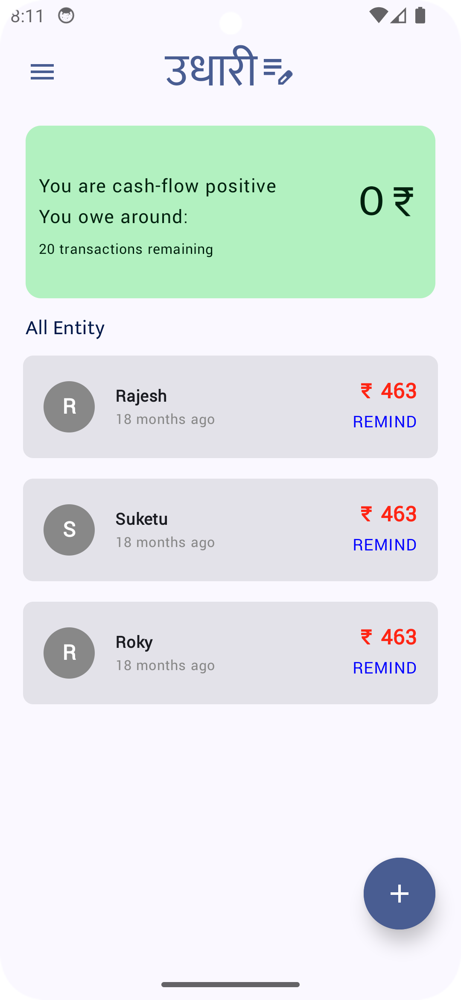
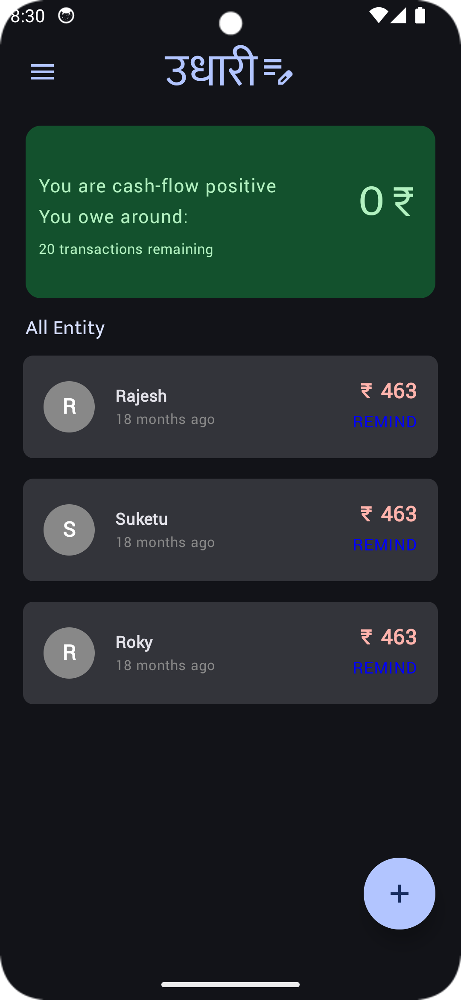

# Udhari: The Notebook App to Maintain All of Your Udhari Records

Udhari is a simple and intuitive app designed to help you keep track of all your udhari (loan) records. Whether you’ve lent money to someone or borrowed it, Udhari ensures you never lose track of your transactions.

## Viedo
[Youtube link](https://youtu.be/5X0QFZvolsg?si=S2NYCSRB9_IZmA9T)

## Screenshots

| Light Mode | Dark Mode |
|-------------------|-------------------|
|  |  |

For more screenshots, check out the [screenshots.md](SCREENSHOT.md) file.

---

## Features
- Track both lent and borrowed amounts.
- Add different notebooks for different purposes.
- Light and dark mode support.
- Simple and user-friendly interface.

---

## Working On...
I am continuously improving Udhari! Here’s what i am currently working on:
- Adding a transaction management system.
- Maintaining a dashboard to provide an overall idea of your finances based on transaction amounts.

---

## Made By
Henil Chhipani

For feedback or suggestions, feel free to mail me at [henilchhipani@gmail.com](mailto:henilchhipani@gmail.com).

---

**Thank you**
