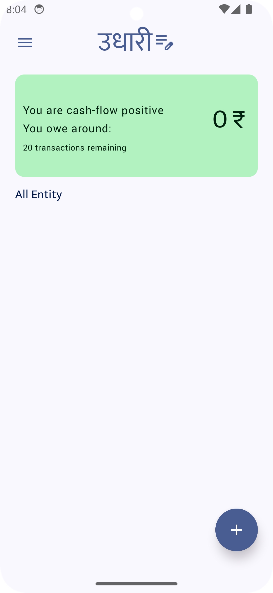
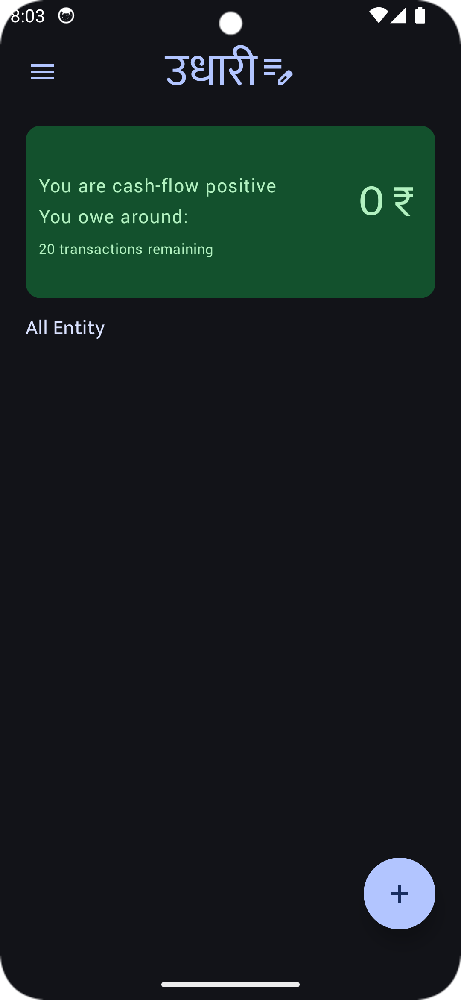
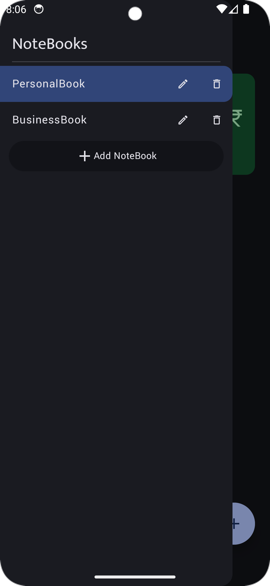
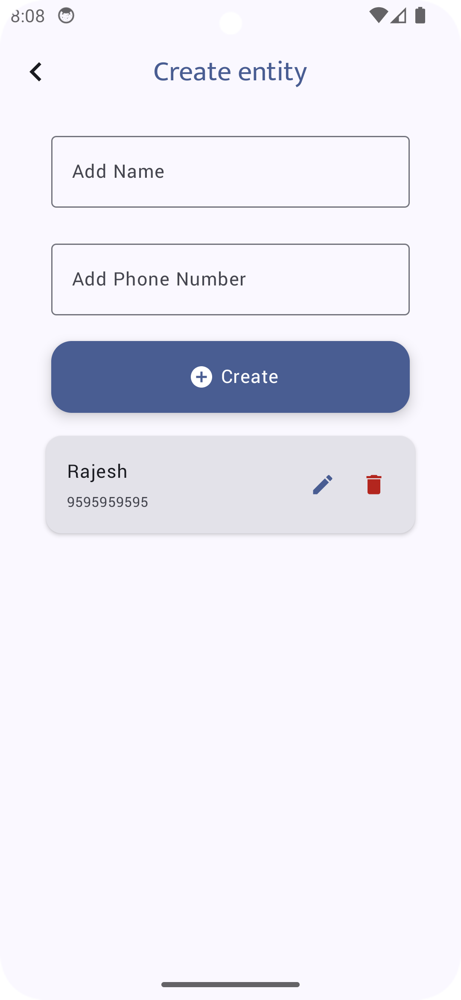
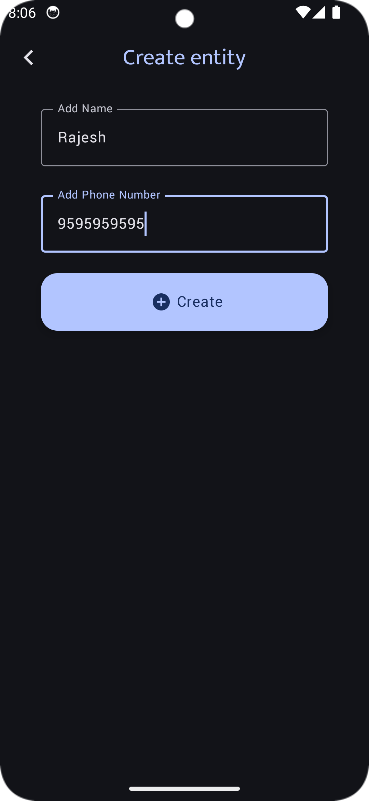
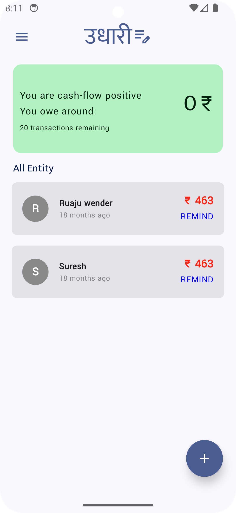
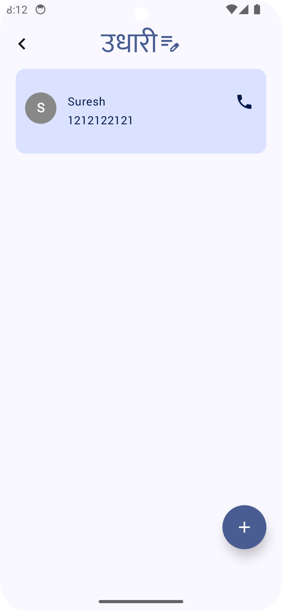

# Screenshots

## Light and Dark UI with Material 3 Components
The app features a modern and responsive design using Material 3 components, supporting both light and dark themes.

| Light Mode | Dark Mode |
|------------|-----------|
|  |  |

---

## Different Notebooks for Different Purposes
Organize your transactions by creating separate notebooks for different purposes, such as personal or business.

| Light Mode | Dark Mode |
|------------|-----------|
|  |  |

---

## Create Entities for Transactions
Easily create entities to enter and manage transactions.

| Light Mode | Dark Mode |
|------------|-----------|
|  |  |

---

## Manage Transactions in Different Notebooks
Keep your transactions organized by managing them in separate notebooks.

| Personal Notebook | Business Notebook |
|-------------------|-------------------|
|  |  |

---

## User Details with Calling Feature (Working)
Add user details and access calling features directly from the app.

---

## Upcoming Features
We are currently working on:
- Adding a transaction management system.
- Maintaining a dashboard to provide an overall idea of your finances based on transaction amounts.

Stay tuned for updates!